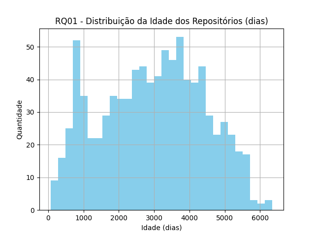
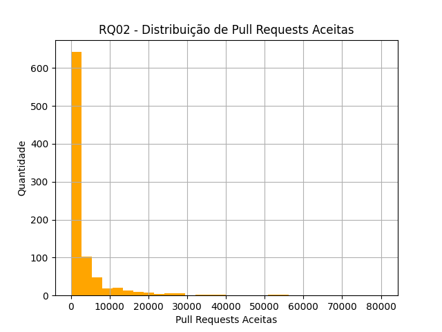
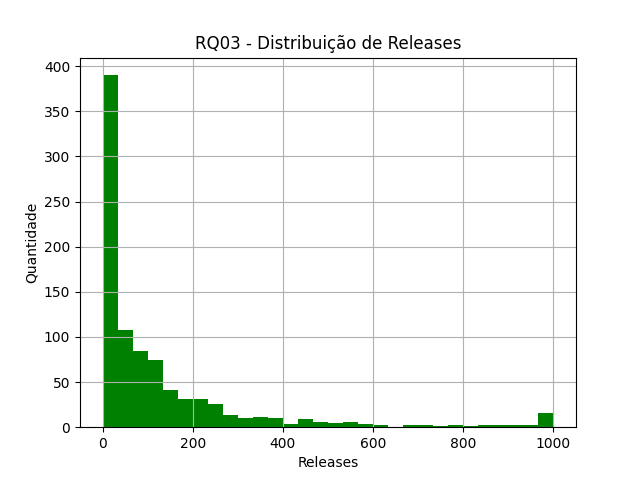
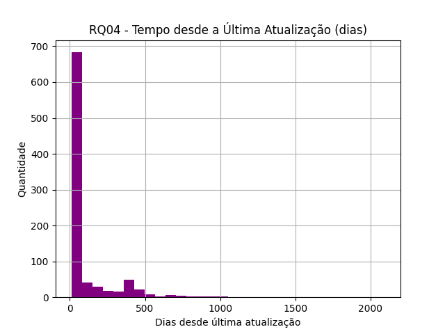
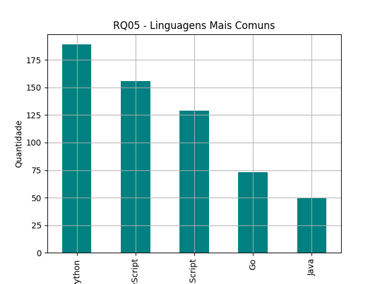
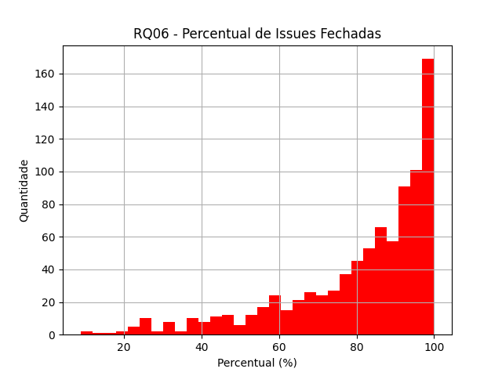
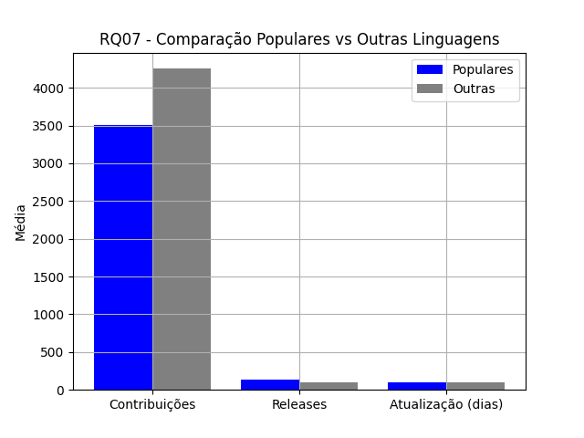

# Relatório de Análise de Repositórios Populares (Versão 1.0)

## 1. Introdução

Este relatório final apresenta uma análise sobre as principais características dos sistemas open-source mais populares do GitHub, uma plataforma de hospedagem de código-fonte e arquivos com controle de versão usando o Git. O objetivo central deste estudo é compreender os fatores que contribuem para o sucesso e a relevância desses projetos, considerando aspectos como maturidade, colaboração externa, frequência de lançamentos, atualização contínua, escolha de linguagem de programação e eficiência na resolução de problemas. O relatório também investiga se a escolha de linguagens de programação mais populares está associada a uma maior frequência de atualizações, maior volume de contribuições externas e níveis mais elevados de popularidade entre os repositórios analisados.

Para isso, foram coletados e analisados dados dos 1.000 repositórios com maior número de estrelas, utilizando técnicas de mineração de dados e análise estatística. O estudo busca identificar padrões recorrentes e tendências que possam servir de referência para desenvolvedores, pesquisadores e gestores de projetos de software livre.

Além de responder às sete questões de pesquisa propostas, este relatório discute as hipóteses levantadas ao longo do trabalho, apresenta resultados quantitativos e gráficos ilustrativos, e reflete sobre o perfil dos projetos open-source de destaque. A abordagem adotada integra métodos automatizados de coleta e processamento de dados, garantindo maior precisão e reprodutibilidade dos resultados.

## 2. Hipóteses Informais

**RQ 01. Sistemas populares são maduros/antigos?**
* **Métrica:** Idade do repositório (calculado a partir da data de sua criação) 
* **Hipótese:** Acreditamos que a maioria dos sistemas populares será relativamente antiga e madura, com pelo menos alguns anos de existência (2-5). A popularidade geralmente é construída ao longo do tempo, e projetos mais antigos tiveram mais oportunidade de crescer, acumular estrelas e atrair colaboradores.

**RQ 02. Sistemas populares recebem muita contribuição externa?**
* **Métrica:** Total de pull requests aceitas
* **Hipótese:** Esperamos que repositórios populares tenham um número muito alto de pull requests aceitas, pois a alta popularidade deve atrair muitas contribuições externas de comunidades de desenvolvimento.

**RQ 03. Sistemas populares lançam releases com frequência?**
* **Métrica:** Total de releases
* **Hipótese:** Nossa hipótese é que sistemas populares lançam releases com frequência, embora o total possa variar bastante. Projetos bem-sucedidos costumam ter um ciclo de desenvolvimento para entregar novas funcionalidades e correções de bugs aos usuários, o que é refletido no número de releases.

**RQ 04. Sistemas populares são atualizados com frequência?**
* **Métrica:** Tempo até a última atualização (calculado a partir da data de última atualização)
* **Hipótese:** Acreditamos que a grande maioria dos repositórios populares terá sido atualizada muito recentemente (dias ou poucas semanas atrás). A falta de atualização pode sinalizar que um projeto está abandonado, o que normalmente faria com que perdesse popularidade.

**RQ 05. Sistemas populares são escritos nas linguagens mais populares?**
* **Métrica:** Linguagem primária de cada um desses repositórios
* **Hipótese:** Acreditamos que linguagens como JavaScript, Python e TypeScript dominem a lista de linguagens primárias. A popularidade de um projeto está ligada à popularidade da linguagem, pois linguagens mais comuns têm comunidades maiores de desenvolvedores.

**RQ 06. Sistemas populares possuem um alto percentual de issues fechadas?**
* **Métrica:** Razão entre número de issues fechadas pelo total de issues 
* **Hipótese:** Nossa hipótese é que a razão de issues fechadas será alta, provavelmente acima de 80%. Projetos bem mantidos e com alta popularidade precisam gerenciar eficientemente seus problemas reportados para manter a qualidade e a confiança da comunidade.

**RQ 07. Sistemas escritos em linguagens mais populares recebem mais contribuição externa, lançam mais releases e são atualizadas com mais frequência?**
* **Métrica:** Razão entre resultados para os sistemas com as linguagens da reportagem com os resultados de sistemas em outras linguagens 
* **Hipótese:** Nossa hipótese é que os sistemas escritos em linguagens mais populares terão mais contribuições, releases e atualizações do que os desenvolvidos em linguagens menos populares

## 3. Metodologia

Para responder às questões de pesquisa propostas, foi realizado um estudo quantitativo utilizando dados dos 1.000 repositórios mais populares do GitHub. A coleta dos dados foi feita por meio de um script em Python que acessou a API GraphQL do GitHub, extraindo informações como data de criação, número de pull requests aceitas, total de releases, data da última atualização, linguagem primária e número de issues abertas e fechadas de cada repositório.

Os dados coletados foram organizados em um arquivo CSV e posteriormente analisados com o auxílio da biblioteca pandas, permitindo o cálculo de métricas como médias, medianas e distribuições. Para a visualização dos resultados, foram gerados gráficos utilizando a biblioteca matplotlib. As análises consideraram tanto valores absolutos quanto comparações entre grupos de linguagens de programação, facilitando a identificação de padrões e tendências entre os projetos mais populares.

Essa abordagem permitiu uma avaliação objetiva das hipóteses levantadas, fornecendo subsídios para a discussão dos resultados e para a elaboração de conclusões sobre o perfil dos projetos open-source de destaque na plataforma.

## 4. Resultados encontrados

**RQ 01. Sistemas populares são maduros/antigos?**
* **Resultados:** 
A mediana da idade dos repositórios analisados é de aproximadamente 3032 dias. Isso indica que projetos populares tendem a ser antigos, reforçando a hipótese de que maturidade é um fator importante para o sucesso e a popularidade. Isso ocorre porque ao longo do tempo esses repositórios atraem colaboradores engajados, o que favorece a manutenção, documentação e suporte, essenciais para garantir a qualidade de um repositório.

**RQ 02. Sistemas populares recebem muita contribuição externa?**
* **Resultados:** 
A mediana de pull requests aceitas nos repositórios populares é de 829. Isso confirma que projetos populares recebem muitas contribuições externas, validando a hipótese de forte engajamento da comunidade. O engajamento é fundamental para a evolução contínua dos sistemas open-source, pois amplia a diversidade de melhorias, acelera a correção de problemas e fortalece a sustentabilidade do projeto.

**RQ 03. Sistemas populares lançam releases com frequência?**
* **Resultados:** 
A mediana de releases por repositório é de 48. Isso mostra que projetos populares costumam lançar releases com frequência, indicando manutenção ativa e evolução constante. Lançar releases frequentemente garante a entrega contínua de melhorias, correções de falhas e novas funcionalidades, o que acaba transmitindo mais confiança para a comunidade do GitHub e potenciais colaboradores. 

**RQ 04. Sistemas populares são atualizados com frequência?**
* **Resultados:** 
A mediana do tempo desde a última atualização é de 13 dias. Ou seja, a maioria dos projetos populares foi atualizada recentemente, confirmando que estão ativos e em constante evolução. Um repositório que é atualizado frequentemente mostra o comprometimento da comunidade em manter os repositórios relevantes, corrigindo falhas de forma ágil, incorporando novas funcionalidades e garantindo a adaptação contínua às demandas tecnológicas.

**RQ 05. Sistemas populares são escritos nas linguagens mais populares?**
* **Resultados:**
Contagem dos projetos por linguagem:
Python: 189
TypeScript: 156
JavaScript: 129
Go: 73
Java: 50
Essas linguagens estão entre as mais populares globalmente, segundo pesquisas como a "2025 Developer Survey" do StackOverflow. A análise confirma que projetos populares tendem a ser desenvolvidos nas linguagens mais utilizadas o que favorece a atratividade e a colaboração. Destaca-se a linguagem Go, que aparece mais que Java em nossa amostra.

**RQ 06. Sistemas populares possuem um alto percentual de issues fechadas?**
* **Resultados:** 
A mediana do percentual de issues fechadas é de 87%. Esse resultado indica que projetos populares são bem mantidos, com alta taxa de resolução de problemas reportados pela comunidade. A eficiência no tratamento de issues mostra organização, comprometimento dos mantenedores e capacidade de resposta, o que fortalece a confiança dos usuários e incentiva novas contribuições.

**RQ 07. Sistemas escritos em linguagens mais populares recebem mais contribuição externa, lançam mais releases e são atualizadas com mais frequência?**
* **Resultados:** 
Projetos em linguagens populares apresentam medianas maiores: 854 contribuições, 57,5 releases e foram atualizados há 15 dias. Já os projetos em linguagens menos populares apresentam medianas de 774 contribuições, 42 releases e foram atualizados há 13 dias. Isso confirma que projetos em linguagens populares tendem a atrair maior engajamento da comunidade, receber atualizações mais frequentes e lançar novas versões, reforçando a influência da escolha da linguagem no engajamento e evolução do projeto.

