# Relatório Final do Laboratório 02: Um Estudo Sobre as Características de Qualidade de Sistemas Java

*Autores:* Leandra Ramos e Júlia Vidal
*Data:* 18 de setembro de 2025

## 1. Introdução

A popularidade e a complexidade de projetos de software de código aberto têm crescido exponencialmente. Entender a relação entre as características externas de um projeto (como sua popularidade, idade e tamanho) e sua qualidade de código interna é fundamental para a engenharia de software. Este estudo visa investigar empiricamente essas relações, analisando os 1.000 repositórios Java mais populares da plataforma GitHub.

Para guiar esta investigação, foram definidas as seguintes Questões de Pesquisa (RQs):

* *RQ 01.* Qual a relação entre a popularidade dos repositórios e as suas características de qualidade? 
* *RQ 02.* Qual a relação entre a maturidade do repositórios e as suas características de qualidade? 
* *RQ 03.* Qual a relação entre a atividade dos repositórios e as suas características de qualidade? 
* *RQ 04.* Qual a relação entre o tamanho dos repositórios e as suas características de qualidade?

### Hipóteses Iniciais

Antes da coleta e análise dos dados, foram formuladas as seguintes hipóteses para cada questão de pesquisa:

* **Hipótese para RQ01 (Popularidade):** Repositórios mais populares (medidos por estrelas) tendem a apresentar **melhor qualidade** de código (menores valores de CBO e LCOM), devido a uma maior revisão por pares e contribuição da comunidade.
* **Hipótese para RQ02 (Maturidade):** Repositórios mais maduros (mais antigos) tendem a ter **melhor qualidade**, pois tiveram mais tempo para processos de refatoração e estabilização da arquitetura.
* **Hipótese para RQ03 (Atividade):** Repositórios mais ativos (medidos pelo número de releases) tendem a ter uma **qualidade ligeiramente inferior**, pois o foco na entrega contínua pode levar a um aumento do débito técnico.
* **Hipótese para RQ04 (Tamanho):** Repositórios maiores (medidos por tamanho em KB) tendem a apresentar **pior qualidade** (maiores valores de CBO e LCOM), devido ao aumento da complexidade inerente a sistemas de grande escala.

## 2. Metodologia

O processo metodológico foi dividido em duas etapas principais: coleta de dados e análise estatística.

### Coleta de Dados

1.  **Seleção da Amostra:** Foram selecionados os 1.000 repositórios com o maior número de estrelas e linguagem primária Java, utilizando a API de busca do GitHub.
2.  **Extração de Métricas de Processo (Variáveis Independentes):** Para cada repositório, as seguintes métricas foram coletadas via API do GitHub:
    * **Popularidade:** Número de estrelas (`stargazers_count`).
    * **Maturidade:** Idade do repositório em anos, calculada a partir da data de criação (`created_at`).
    * **Atividade:** Contagem total de releases (`releases_url`).
    * **Tamanho:** Tamanho do repositório em kilobytes (`size`).
3.  **Extração de Métricas de Qualidade (Variáveis Dependentes):** A qualidade interna do código foi medida utilizando a ferramenta de análise estática CK (`ck.jar`). As seguintes métricas foram extraídas:
    * **CBO (Coupling Between Objects):** Acoplamento entre objetos.
    * **DIT (Depth of Inheritance Tree):** Profundidade da árvore de herança.
    * **LCOM (Lack of Cohesion in Methods):** Falta de coesão nos métodos.

### Processo de Análise

Um script em Python foi desenvolvido para automatizar o processo. Para cada um dos 1.000 repositórios, o script clonou o projeto, executou a ferramenta CK e agregou os resultados das métricas de qualidade (CBO, DIT, LCOM) por repositório utilizando a **mediana**, para reduzir o efeito de outliers. Para responder às RQs, foram utilizados gráficos de dispersão para visualização e o coeficiente de **correlação de Spearman** para quantificar a força e a direção da relação entre as variáveis, cumprindo os requisitos bônus da atividade.

## 3. Resultados

Nesta seção, são apresentados os resultados da análise estatística para cada questão de pesquisa.

### Resultados para RQ01: Popularidade vs. Qualidade

* **Popularidade vs. Mediana CBO:** Correlação de Spearman = -0.010 (p-valor = 0.761)
* **Popularidade vs. Mediana DIT:** Correlação de Spearman = -0.029 (p-valor = 0.383)
* **Popularidade vs. Mediana LCOM:** Correlação de Spearman = 0.014 (p-valor = 0.671)

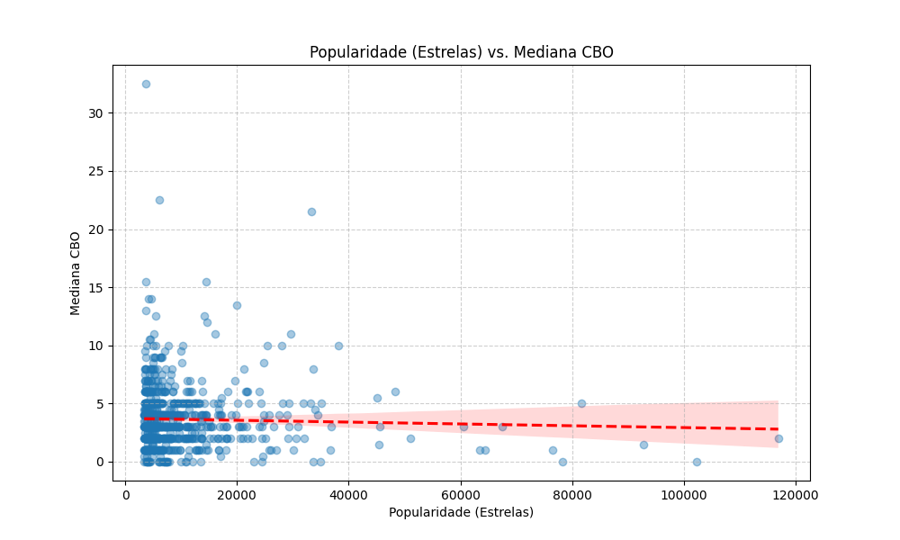
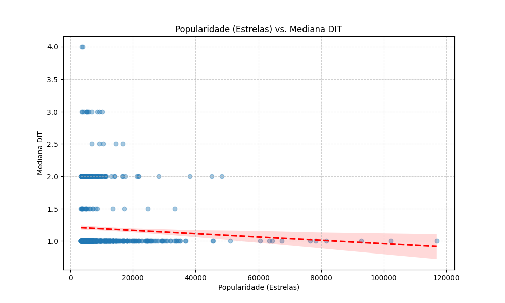
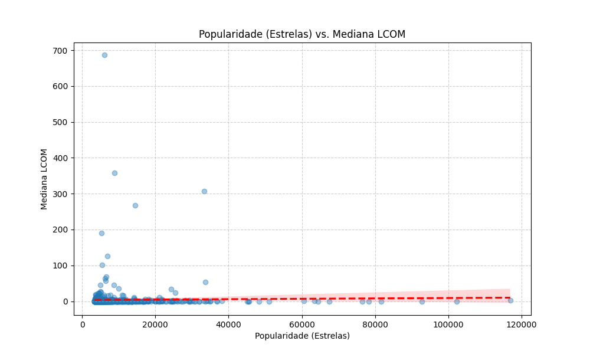

### Resultados para RQ02: Maturidade vs. Qualidade

* **Maturidade vs. Mediana CBO:** Correlação de Spearman = 0.003 (p-valor = 0.939)
* **Maturidade vs. Mediana DIT:** Correlação de Spearman = 0.124 (p-valor = 0.000)
* **Maturidade vs. Mediana LCOM:** Correlação de Spearman = 0.073 (p-valor = 0.030)

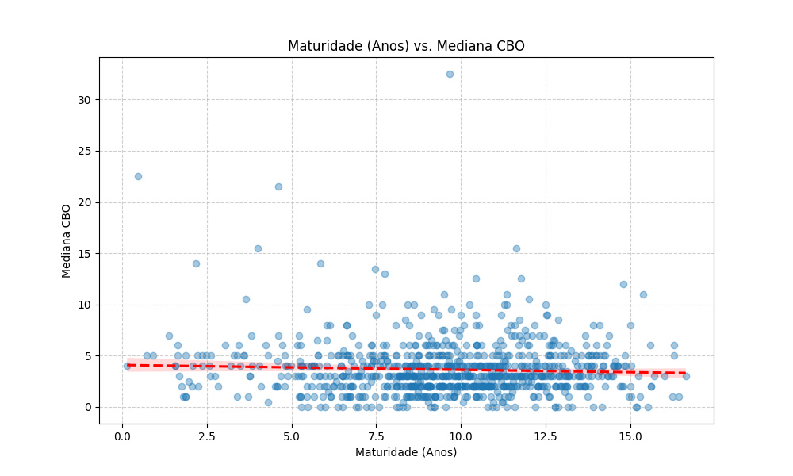
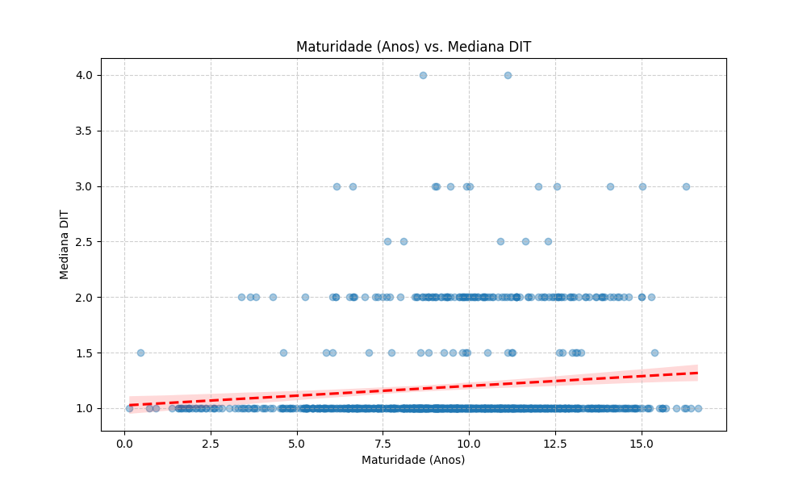
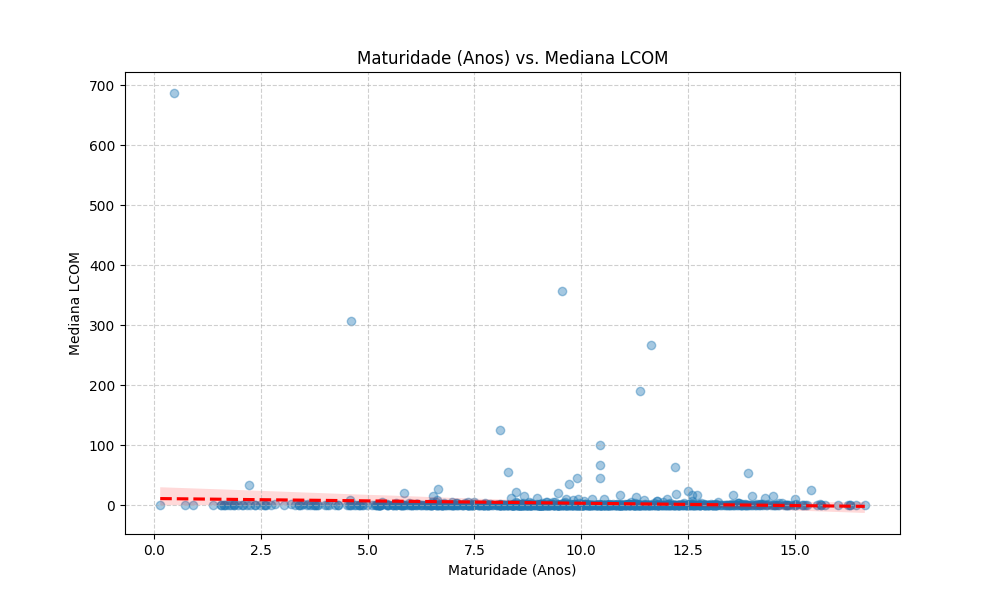

### Resultados para RQ03: Atividade vs. Qualidade

* **Atividade vs. Mediana CBO:** Correlação de Spearman = 0.143 (p-valor = 0.000)
* **Atividade vs. Mediana DIT:** Correlação de Spearman = -0.013 (p-valor = 0.695)
* **Atividade vs. Mediana LCOM:** Correlação de Spearman = 0.097 (p-valor = 0.004)

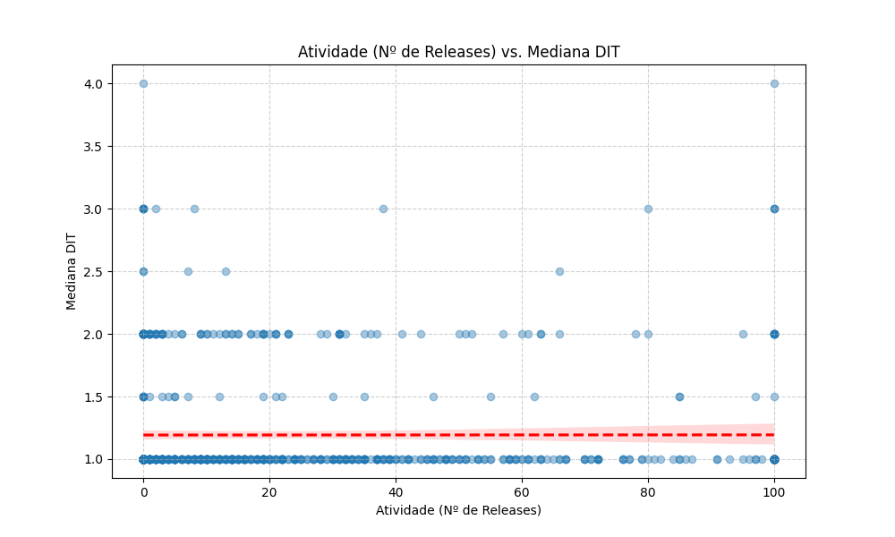
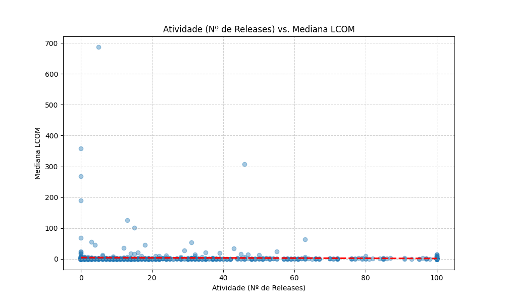

### Resultados para RQ04: Tamanho vs. Qualidade

* **Tamanho vs. Mediana CBO:** Correlação de Spearman = 0.128 (p-valor = 0.000)
* **Tamanho vs. Mediana DIT:** Correlação de Spearman = 0.009 (p-valor = 0.782)
* **Tamanho vs. Mediana LCOM:** Correlação de Spearman = 0.092 (p-valor = 0.006)

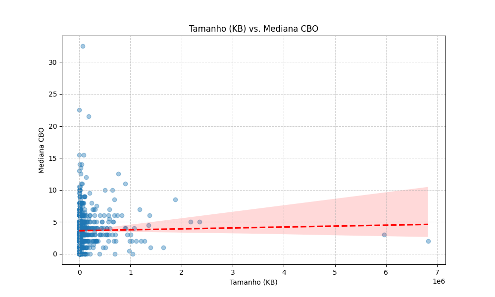
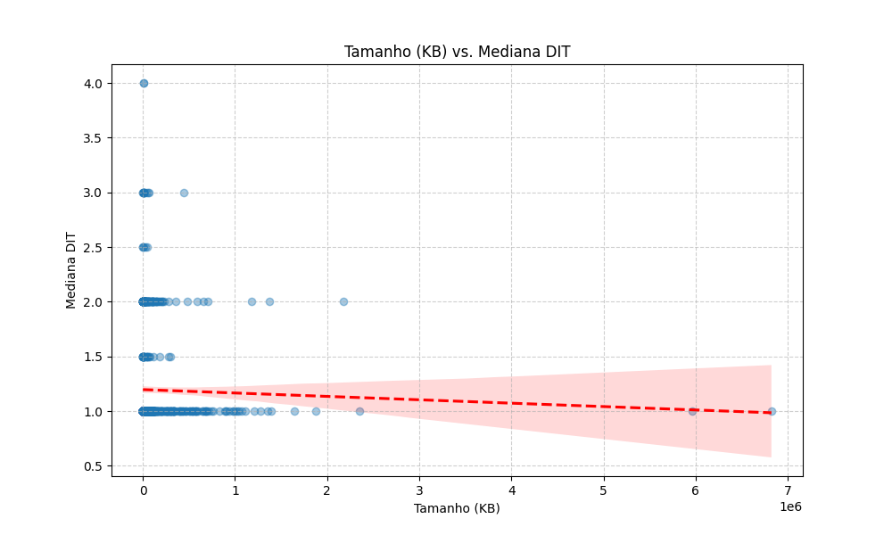
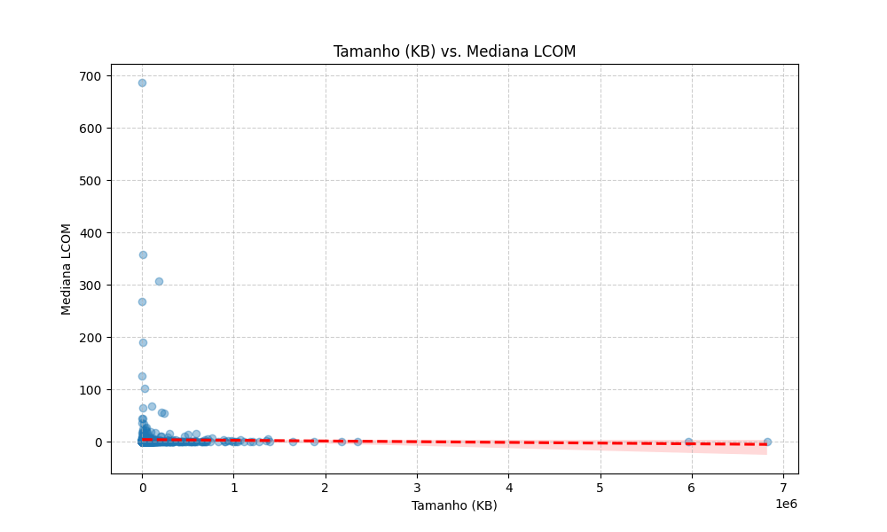

## 4. Discussão

Esta seção interpreta os resultados, comparando-os com as hipóteses iniciais.

### Discussão sobre a RQ01 (Popularidade)
A hipótese de que repositórios mais populares teriam melhor qualidade de código foi refutada.

A análise dos três gráficos mostra que a linha de tendência para as métricas CBO, DIT e LCOM é praticamente horizontal, indicando uma correlação estatística quase nula.

Portanto, a popularidade de um projeto (número de estrelas) não é um indicador confiável de sua qualidade interna de código. A fama do repositório parece ser impulsionada por outros fatores, como sua utilidade ou documentação, e não por um design de código superior.

### Discussão sobre a RQ02 (Maturidade)
A hipótese de que repositórios mais antigos teriam melhor qualidade de código foi majoritariamente refutada, com resultados contrários ao esperado.

A análise mostra que não há correlação entre a idade do projeto e o acoplamento (CBO), pois a linha de tendência é plana.

No entanto, para as métricas DIT e LCOM, foi encontrada uma correlação positiva fraca. Isso significa que, com o passar dos anos, os projetos tendem a desenvolver hierarquias de herança ligeiramente mais profundas (maior DIT) e classes menos coesas (maior LCOM).

A conclusão é que a qualidade do código não melhora com o tempo; pelo contrário, há uma leve tendência de degradação, possivelmente pelo acúmulo de complexidade e débito técnico.

### Discussão sobre a RQ03 (Atividade)
A hipótese de que repositórios mais ativos (com mais releases) teriam uma qualidade de código ligeiramente inferior foi parcialmente confirmada pelos dados.

A análise mostra que a atividade não tem correlação com a profundidade da herança (DIT), que se mantém baixa independentemente do número de releases.

No entanto, para o acoplamento (CBO) e a falta de coesão (LCOM), os gráficos mostram uma correlação positiva fraca. Isso indica que projetos com um ciclo de entregas mais intenso tendem a apresentar um código um pouco mais acoplado e menos coeso.

A conclusão é que a alta frequência de releases pode levar ao acúmulo de um leve débito técnico, impactando negativamente a manutenibilidade do código.

### Discussão sobre a RQ04 (Tamanho)
A hipótese de que repositórios maiores teriam pior qualidade de código foi parcialmente confirmada.

A análise não mostrou correlação entre o tamanho e a profundidade da herança (DIT), que se manteve baixa independentemente da escala do projeto.

Contudo, foi identificada uma correlação positiva fraca entre o tamanho e as métricas de acoplamento (CBO) e falta de coesão (LCOM). Os gráficos mostram que, embora a relação não seja forte, projetos maiores tendem a ter valores de CBO e LCOM ligeiramente mais altos.

Isso sugere que, à medida que um sistema cresce, sua complexidade inerente aumenta, levando a um código com maior acoplamento e menor coesão, o que pode dificultar a manutenção a longo prazo.

## 5. Conclusão

Este estudo investigou a relação entre características de processo (popularidade, maturidade, atividade e tamanho) e métricas de qualidade de código (CBO, DIT, LCOM) em 1.000 repositórios Java do GitHub. Os resultados indicam que as correlações encontradas, embora por vezes estatisticamente significativas, são consistentemente fracas.

A popularidade não demonstrou ter relação com a qualidade do código. De forma contrária à hipótese, a maturidade (idade) mostrou uma leve tendência de degradação em algumas métricas, sugerindo um aumento da complexidade com o tempo. Por fim, a atividade (número de releases) e o tamanho confirmaram as hipóteses, associando-se a uma qualidade de código sutilmente inferior, possivelmente devido ao acúmulo de débito técnico e à complexidade inerente de sistemas maiores.

### Limitações do Estudo

* A métrica de "tamanho em KB" é uma aproximação e não representa diretamente a complexidade ou as linhas de código (LOC).
* A análise se baseou apenas na mediana das métricas por projeto, o que simplifica a distribuição real da qualidade dentro de um mesmo repositório.
* O estudo se limita a repositórios Java no GitHub, e os resultados podem não ser generalizáveis para outras linguagens ou plataformas.

### Trabalhos Futuros

* Analisar a evolução das métricas de qualidade ao longo do tempo para um mesmo conjunto de repositórios.
* Incluir outras métricas de qualidade, como complexidade ciclomática (WMC) e número de métodos públicos (NPM).
* Realizar uma análise qualitativa em uma amostra de projetos para entender o contexto por trás dos números.