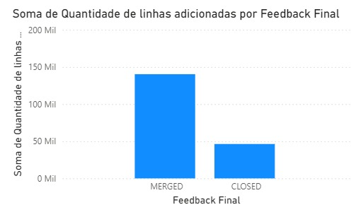
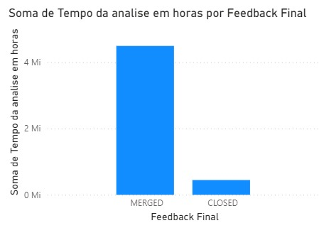
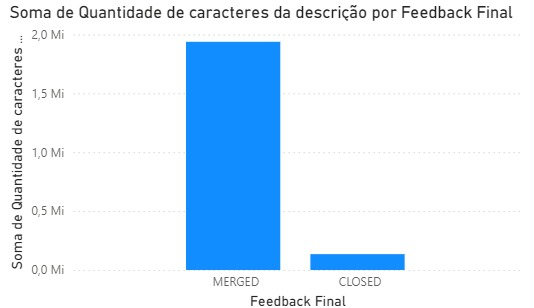
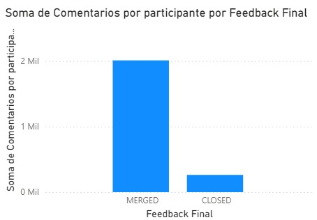
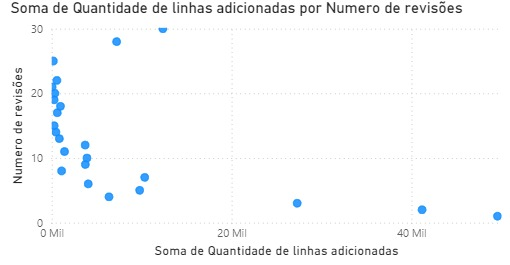
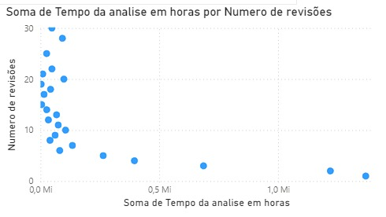
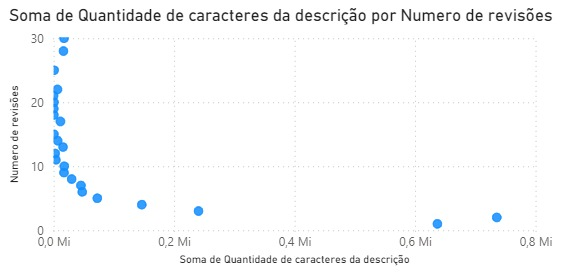
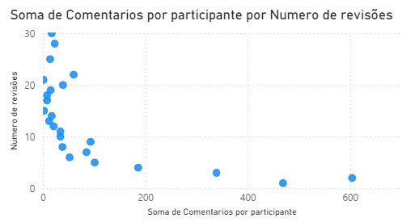

# Relatório Final (Lab 03) 

*Autores:* Leandra Ramos e Júlia Vidal
*Data:* 16 de outubro de 2025

## 1. Introdução

A prática de code review tornou-se uma constante nos processos de desenvolvimento ágeis. Em essência, consiste na interação entre desenvolvedores e revisores para inspecionar o código produzido antes de integrá-lo à base principal, visando garantir a qualidade e evitar a inclusão de defeitos.

No contexto do GitHub, essas atividades de code review ocorrem a partir da avaliação de Pull Requests (PRs). Ao final desse processo, a solicitação de merge pode ser aprovada ou rejeitada pelo revisor.

O objetivo deste laboratório é analisar a atividade de code review em repositórios populares do GitHub, identificando variáveis que influenciam o resultado final (merge) de um PR, sob a perspectiva de desenvolvedores.

## 2. Questões de Pesquisa e Hipóteses Iniciais

As hipóteses iniciais a seguir são elaboradas com base nas Questões de Pesquisa (RQs) e Métricas definidas na metodologia do laboratório.

### A. Dimensão: Feedback Final das Revisões (Status do PR)

(A variável dependente é o status final: MERGED ou CLOSED)

| RQ | Métrica (Variável Independente) | Hipótese Informal (Correlação Esperada) |
| :---: | :--- | :--- |
| *RQ 01* | Tamanho (Arquivos / Linhas Adicionadas/Removidas) | PRs menores têm *maior chance de serem MERGED*, pois representam um risco menor e exigem menos esforço de revisão. |
| *RQ 02* | Tempo de Análise (Intervalo Criação/Fechamento) | PRs que levam muito tempo para serem analisados têm *maior chance de serem CLOSED* (rejeitados ou abandonados), pois refletem dificuldade ou desinteresse do revisor. |
| *RQ 03* | Descrição (Número de caracteres do corpo) | PRs com descrições mais longas e claras têm *maior chance de serem MERGED*, pois fornecem o contexto necessário para a revisão. |
| *RQ 04* | Interações (Participantes / Comentários) | Um alto número de interações (participantes e/ou comentários) pode indicar controvérsia ou problemas no PR, correlacionando-se *positivamente com o status CLOSED*. |

### B. Dimensão: Número de Revisões

(A variável dependente é o número total de revisões realizadas)

| RQ | Métrica (Variável Independente) | Hipótese Informal (Correlação Esperada) |
| :---: | :--- | :--- |
| *RQ 05* | Tamanho (Arquivos / Linhas Adicionadas/Removidas) | PRs maiores (mais código) exigirão um *Número de Revisões maior* para garantir a qualidade e a cobertura da inspeção. |
| *RQ 06* | Tempo de Análise (Intervalo Criação/Fechamento) | Quanto mais tempo um PR leva para ser analisado, maior o *Número de Revisões, refletindo o tempo necessário para o ciclo de *feedback e correção. |
| *RQ 07* | Descrição (Número de caracteres do corpo) | Descrições claras reduzem as dúvidas e o ruído, correlacionando-se *negativamente* com o Número de Revisões (descrições melhores = menos idas e vindas). |
| *RQ 08* | Interações (Participantes / Comentários) | Mais interações (comentários) estão diretamente associadas a um *Número de Revisões maior, pois a métrica de interações é uma proxy para o volume de *feedback e discussão. |

## 3. Metodologia
A metodologia deste estudo foi dividida em três etapas principais: coleta de dados, extração e filtragem de métricas, e análise e visualização de dados.

### 1. Coleta de Dados

Os dados foram coletados diretamente da API v3 do GitHub. Um script em Python foi desenvolvido para automatizar as requisições, utilizando um Token de Acesso Pessoal (PAT) para autenticação e para garantir um maior limite de requisições.

A coleta foi focada em Pull Requests (PRs) de cinco repositórios de software de código aberto, de grande porte e com alta atividade, sendo eles:

* `facebook/react`
* `kubernetes/kubernetes`
* `tensorflow/tensorflow`
* `dotnet/runtime`
* `home-assistant/core`

O script foi projetado para iterar sobre a lista de PRs de cada repositório, buscando especificamente por aqueles com o estado `closed`.

### 2. Extração e Filtragem de Métricas

Para cada PR identificado, um processo de extração detalhada foi realizado para obter as métricas de interesse. No entanto, para garantir a relevância e a qualidade do dataset, foram aplicados os seguintes critérios de filtragem, e apenas os PRs que atenderam a **todos** os critérios foram incluídos na análise final:

1.  **Status do PR:** Apenas PRs com status final `closed` foram considerados. Isso inclui tanto os que foram integrados ao código (`MERGED`) quanto os que foram fechados sem integração.
2.  **Mínimo de Revisões:** O PR deveria ter recebido pelo menos **uma revisão formal** para ser incluído.
3.  **Tempo Mínimo de Análise:** O tempo total entre a criação e o fechamento do PR deveria ser de, no mínimo, **uma hora**.

Para os PRs que passaram por essa filtragem, as seguintes métricas foram extraídas e salvas em um arquivo no formato `.csv`:

* **Variáveis Dependentes:**
    * `feedback_final`: O resultado do PR (`MERGED` ou `CLOSED`).
    * `numero_revisoes`: A quantidade total de revisões formais recebidas.
* **Variáveis Independentes:**
    * `tamanho_files`: Número de arquivos modificados.
    * `tamanho_linhas_adicionadas`: Total de linhas de código adicionadas.
    * `tamanho_linhas_removidas`: Total de linhas de código removidas.
    * `tempo_analise_horas`: O tempo total do ciclo de vida do PR, em horas.
    * `descricao_caracteres`: O tamanho da descrição do PR, em número de caracteres.
    * `interacoes_comentarios`: A quantidade de comentários na thread do PR.

### 3. Análise e Visualização de Dados

O arquivo `.csv` gerado na etapa anterior foi importado para a ferramenta de Business Intelligence **Microsoft Power BI** para a criação das visualizações e análise das perguntas de pesquisa. A abordagem para a visualização variou conforme a natureza das variáveis em cada pergunta:

* **Para RQs 01 a 04 (Numérico vs. Categórico):** Para comparar as métricas numéricas (tamanho, tempo, descrição e interações) com o `feedback_final` (categórico), foram utilizados **Gráficos de Colunas Clusterizadas**. A agregação dos dados foi configurada para exibir a **média** da métrica numérica para cada uma das duas categorias (`MERGED` e `CLOSED`), permitindo uma comparação direta entre os dois grupos.

* **Para RQs 05 a 08 (Numérico vs. Numérico):** Para investigar a relação entre duas variáveis numéricas, foram utilizados **Gráficos de Dispersão (Scatter Plots)**. Uma **linha de tendência** foi adicionada a cada gráfico para facilitar a identificação visual da força e da direção da correlação entre as variáveis.

## 3. Resultados
Nesta seção, são apresentados os resultados obtidos através da análise dos dados coletados, com o objetivo de responder a cada uma das oito perguntas de pesquisa (RQs) formuladas. Cada análise é suportada por uma visualização de dados gerada no Power BI.

---

### **RQ 01. Qual a relação entre o tamanho dos PRs e o feedback final das revisões?**

**Resposta:**
Existe uma relação clara e observável entre o tamanho de um Pull Request (medido pelo número de linhas adicionadas) e o seu feedback final. PRs que são fechados sem serem integrados ao código (`CLOSED`) são, em média, significativamente maiores do que os PRs que são aceitos e integrados (`MERGED`).

**Análise:**
O gráfico de barras acima compara a média de linhas de código adicionadas para os PRs `MERGED` (427,33 linhas) e `CLOSED` (1.839,47 linhas). A diferença de mais de 4 vezes sugere que PRs de grande escopo enfrentam um escrutínio maior e possuem uma probabilidade mais alta de serem rejeitados.

---

### **RQ 02. Qual a relação entre o tempo de análise dos PRs e o feedback final das revisões?**

**Resposta:**
Há uma relação perceptível entre o tempo de análise e o resultado de um Pull Request. PRs que permanecem abertos por mais tempo têm uma tendência maior a serem fechados sem merge (`CLOSED`).

**Análise:**
O gráfico de colunas demonstra que PRs `CLOSED` levaram em média **231,28 horas** para serem finalizados, enquanto PRs `MERGED` tiveram um tempo médio de **185,06 horas**. Esta diferença sugere que PRs que se prolongam no tempo enfrentam maiores desafios para serem aprovados.

---

### **RQ 03. Qual a relação entre a descrição dos PRs e o feedback final das revisões?**

**Resposta:**
Existe uma relação sutil entre o tamanho da descrição de um Pull Request e seu resultado final. Em média, PRs que são `CLOSED` tendem a ter descrições mais longas.

**Análise:**
O gráfico compara a média de caracteres na descrição para PRs `CLOSED` (2.130,63 caracteres) e `MERGED` (1.846,12 caracteres). Uma possível interpretação é que PRs mais complexos — e com maior chance de rejeição — exigem uma justificativa textual mais elaborada.

---

### **RQ 04. Qual a relação entre as interações nos PRs e o feedback final das revisões?**

**Resposta:**
Existe uma forte relação entre o volume de interações (comentários) e o resultado de um PR. PRs que são `CLOSED` apresentam, em média, um número significativamente maior de comentários.

**Análise:**
O gráfico de colunas mostra que PRs `CLOSED` têm uma média de **5,48 comentários**, enquanto PRs `MERGED` apresentam uma média de **3,53 comentários**. Um volume elevado de interações sugere maior debate ou controvérsia, aumentando a probabilidade de o PR ser considerado inviável.

---

### **RQ 05. Qual a relação entre o tamanho dos PRs e o número de revisões realizadas?**

**Resposta:**
Não há uma correlação forte ou clara entre o tamanho de um Pull Request e o número de revisões que ele recebe.

**Análise:**
O gráfico de dispersão acima relaciona o tamanho de um PR (eixo X) com o número de revisões (eixo Y). A linha de tendência praticamente horizontal sinaliza uma correlação muito fraca, sugerindo que o tamanho do PR, por si só, não determina a quantidade de revisões.

---

### **RQ 06. Qual a relação entre o tempo de análise dos PRs e o número de revisões realizadas?**

**Resposta:**
Não foi encontrada uma correlação significativa entre o tempo de análise de um Pull Request e o número de revisões que ele recebe.

**Análise:**
O gráfico de dispersão plota o tempo de análise (eixo X) contra o número de revisões (eixo Y). A linha de tendência plana indica uma correlação inexistente, mostrando que a duração do ciclo de vida de um PR não é um fator determinante para a quantidade de revisões formais.

---

### **RQ 07. Qual a relação entre a descrição dos PRs e o número de revisões realizadas?**

**Resposta:**
Não foi observada uma relação clara entre o tamanho da descrição de um Pull Request e o número de revisões que ele atrai.

**Análise:**
O gráfico de dispersão relaciona o número de caracteres na descrição (eixo X) com o número de revisões (eixo Y). A linha de tendência horizontal denota uma correlação muito fraca, indicando que uma descrição detalhada não resulta em mais revisões.

---

### **RQ 08. Qual a relação entre as interações nos PRs e o número de revisões realizadas?**

**Resposta:**
Foi identificada uma correlação positiva, ainda que fraca, entre o número de interações (comentários) e a quantidade de revisões formais em um Pull Request.

**Análise:**
Diferentemente das métricas anteriores, a linha de tendência neste gráfico exibe uma inclinação sutil e positiva. Isso indica que um aumento no número de comentários está ligeiramente associado a um aumento no número de revisões, possivelmente porque PRs mais debatidos atraem mais atenção da equipe.
